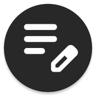
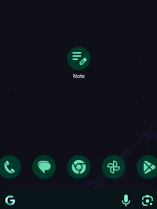
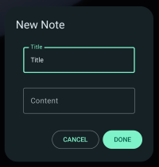
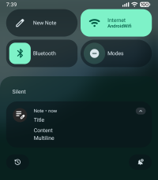
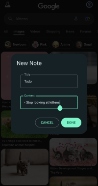
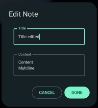

# Notification Notes

---

### An android app to quickly and simply push a note to your notifications!

---

  

---

This app allows you to send text as notifications. You can edit these notifications. The UI is a simple Material You popup that does not disrupt your flow.

Useful for small thoughts you don't want forgetting but are not important enough to put in a notes app.

---

###### Features:

- Simple overlay UI
  
  - Continue what you were doing!

- Silent
  
  - Doesn't nag you about it

- Editable
  
  - Tap the notification note to edit it!

 

- - Multiline content

- You can make lists!

- Quick tile
  
  - For quick and easy notes while in other apps

- Non-intrusive design
  
  - There when you need it
  
  - Swipe the note away, and its gone. No weird tiny button to dismiss it.

- Resistant to the "Clear all" button
  
  - Feel free to instantly discard junk notifications without messing up your notes

- Completely free, open source, and private
  
  - The only permission it needs is to post notifications
  
  - Absolutely no ads or freemium models

- Material 3 Expressive
  
  - For a seamless and native-feeling UI.
  
  - It fits around **you,** not the other way around.

---

###### Installation

(Currently android only)

1. Go to the **latest release** and download `notificationnotes.apk`

2. Run the APK file.

3. Google Play Protect will want to scan it. This is normal as this app does not come from the Google Play Store.
   
   - You can scan it if you want, it really doesn't matter.

4- Some phones will not add the app to the home screen if it's installed from a file.

- Go to your app drawer and search for "Note".

5- ***IMPORTANT!*** Make sure to **give the app notification permissions.**

   1- Long press the app icon and select "App info".

   2- Tap "Notifications" and turn them on.

6- **How to enable Quick Tile:**

   1- Go to your quick tile page and tap the edit button. (Usually a little pen/pencil icon.)

   2- Scroll down to the Installed Apps section and search for a pen icon that has the label "New note" or "Notification Note"

   3- Drag it up and pin it

---

**This app is Free and Open Source.**

- You may use it and modify it for your own purposes

- You may redistribute unmodified versions as long as you link back to this site

- You may redistribute modified versions as long as you link back to this site AND explain exactly what has been modified.

- You may **NOT** redistribute modified or unmodified versions for financial gain

- You may **NOT** redistribute modified or unmodified versions without credit

- You may **NOT** redistribute modified or unmodified versions that might harm or cause unwanted behaviour on the user's end

- You may **NOT** use this application or any of it's contents for malicious or illegal purposes

- I take **NO** responsibility for versions that have been modified
  
  - The safest way is to download directly from the official GitHub repository
